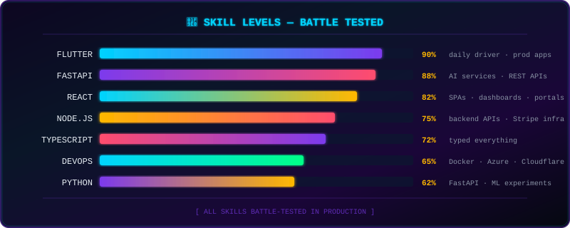

<div align="center">

<!-- ═══════════════════════════════════════════════════════════════ -->
<!--                     ANIMATED HEADER                           -->
<!-- ═══════════════════════════════════════════════════════════════ -->


</div>

<!-- ═══════════════════════════════════════════════════════════════ -->
<!--                    SIGNAL ORIGIN BADGE ROW                    -->
<!-- ═══════════════════════════════════════════════════════════════ -->

<div align="center">

[](https://qambers-cyber-grid.vercel.app)
&nbsp;
[](https://linkedin.com/in/qamber-muhammed-hanif/)
&nbsp;
[](https://cherag.pages.dev)
&nbsp;


</div>

<br/>

<!-- ═══════════════════════════════════════════════════════════════ -->
<!--              ★ WOW FEATURE: SIGNAL ORIGIN RADAR ★             -->
<!-- ═══════════════════════════════════════════════════════════════ -->

<div align="center">

```
╔══════════════════════════════════════════════════════════════════════════════╗
║                                                                              ║
║    ████████╗██████╗  █████╗ ███╗   ██╗███████╗███╗   ███╗██╗████████╗      ║
║       ██╔══╝██╔══██╗██╔══██╗████╗  ██║██╔════╝████╗ ████║██║╚══██╔══╝      ║
║       ██║   ██████╔╝███████║██╔██╗ ██║███████╗██╔████╔██║██║   ██║         ║
║       ██║   ██╔══██╗██╔══██║██║╚██╗██║╚════██║██║╚██╔╝██║██║   ██║         ║
║       ██║   ██║  ██║██║  ██║██║ ╚████║███████║██║ ╚═╝ ██║██║   ██║         ║
║       ╚═╝   ╚═╝  ╚═╝╚═╝  ╚═╝╚═╝  ╚═══╝╚══════╝╚═╝     ╚═╝╚═╝   ╚═╝         ║
║                                                                              ║
║               S I G N A L   O R I G I N   D E T E C T E D                  ║
║                                                                              ║
╠══════════════════════════════════════════════════════════════════════════════╣
║                                                                              ║
║   COORDINATES  ·  25.1264° N, 62.3225° E                                    ║
║                                                                              ║
║   ···················( SIGNAL PULSE )···················                    ║
║   ·              ○ ○ ○ ○ ◉ ○ ○ ○ ○                    ·                    ║
║   ·           ○               ·               ○        ·                    ║
║   ·        ○        ○ ○ ○ ◉ ○ ○ ○        ○             ·                    ║
║   ·      ○       ○                   ○       ○         ·                    ║
║   ·     ○      ○        ○ ◉ ○        ○      ○          ·                    ║
║   ·     ○     ○       ○       ○       ○     ○          ·                    ║
║   ·     ○     ○      ○   ███  ○      ○     ○           ·                    ║
║   ·     ○     ○      ○  █YOU█ ○      ○     ○           ·  GWADAR            ║
║   ·     ○     ○      ○   ███  ○      ○     ○           ·  BALOCHISTAN       ║
║   ·     ○      ○       ○       ○       ○      ○        ·  PAKISTAN          ║
║   ·      ○       ○        ○ ◉ ○        ○       ○       ·                    ║
║   ·        ○        ○ ○ ○ ◉ ○ ○ ○        ○             ·                    ║
║   ·           ○               ·               ○        ·                    ║
║   ·              ○ ○ ○ ○ ◉ ○ ○ ○ ○                    ·                    ║
║   ···················( LOCKED ON )·····················                     ║
║                                                                              ║
║   [ RANGE: ~650km from where the apps stop ]  [ STATUS: SHIPPING ]          ║
║                                                                              ║
╚══════════════════════════════════════════════════════════════════════════════╝
```

</div>

<br/>

<!-- ═══════════════════════════════════════════════════════════════ -->
<!--                        WHOAMI BLOCK                           -->
<!-- ═══════════════════════════════════════════════════════════════ -->



<br/><br/>

<div align="center">

<table>
<tr>
<td width="50%" valign="top">

```yaml
# qamber.config.yml
identity:
  name: "Qamber Muhammed Hanif"
  role: "Full Stack Engineer"
  degree: "BSCS · GPA 3.40 · Class of 2027"
  university: "University of Turbat"
  location: "Gwadar, Balochistan · 25°N 62°E"

mission:
  statement: "Ship production systems, not demos"
  market: "500k+ people, zero app coverage"
  gap: "~650km from where the apps stop"

workflow:
  agents: 4
  tool: "Claude Code"
  strategy: "parallel branches → merge at velocity"
  ships: true

stack:
  - Flutter · FastAPI · React
  - Supabase · Node.js · TypeScript
  - Docker · Azure · Cloudflare
```

</td>
<td width="50%" align="center" valign="top">

<br/>

```
╔══════════════════════════════════╗
║  ⚡  LIVE MISSION STATUS         ║
╠══════════════════════════════════╣
║                                  ║
║  🟢  Karwan     ──  IN DEV       ║
║       Food delivery, Gwadar      ║
║       Flutter · FastAPI · Supa   ║
║                                  ║
║  🔆  Cherág     ──  LIVE         ║
║       AI Study Platform          ║
║       React19 · Gemini · ACA     ║
║                                  ║
║  📖  Pajjar     ──  SHIPPED      ║
║       Offline Language Dict      ║
║       Flutter · SQLite           ║
║                                  ║
║  💼  Unhire     ──  INTERNING    ║
║       Stripe Connect · Node.js   ║
║       NYC Freelance Marketplace  ║
║                                  ║
╚══════════════════════════════════╝
```

</td>
</tr>
</table>

</div>

<br/>

<!-- ═══════════════════════════════════════════════════════════════ -->
<!--               COLORFUL GRADIENT DIVIDER                       -->
<!-- ═══════════════════════════════════════════════════════════════ -->


<br/>

<!-- ═══════════════════════════════════════════════════════════════ -->
<!--                    PROJECTS SECTION                           -->
<!-- ═══════════════════════════════════════════════════════════════ -->

## `⚡ PROJECTS — BUILT FROM THE GAP`

> *Every project below exists because the market failed to show up first.*

<br/>

<!-- ─── KARWAN ─── -->

<table>
<tr>
<td>

### `📦 KARWAN` &nbsp; · &nbsp; Hyperlocal Food Delivery

 &nbsp;
 &nbsp;


**The gap:** Foodpanda covers Pakistan down to Quetta. Gwadar is 650km south. Karwan is the first food delivery platform for two cities with a combined population over 500k.

```
  [ Flutter App ]  [ React Panel ]  [ React Admin ]
         │                │                │
         └────────────────┴────────────────┘
                          │
              ┌─────────────────────┐
              │  FastAPI  ·  Core   │
              │  Supabase · Auth DB │
              └──┬────┬────┬───────┘
                 │    │    │
              [FCM] [Pay] [Azure]
              Push  Jazz  Host
                    Cash
                    Easy
                    Paisa

  COMMISSION: 12%  ·  DELIVERY: restaurant-owned
```


</td>
</tr>
</table>

<br/>

<!-- ─── CHERÁG ─── -->

<table>
<tr>
<td>

### `🔆 CHERÁG` &nbsp; · &nbsp; AI Study Platform &nbsp; · &nbsp; [cherag.pages.dev](https://cherag.pages.dev)

 &nbsp;
 &nbsp;


**The gap:** Quality tutoring in Pakistan costs money students don't have. Cherág converts course material into AI-powered study sessions — free, accessible, MIT licensed.

```
  ┌──────────────────────────────────────────────────┐
  │  React 19 + Vite · TailwindCSS · Cloudflare Pages│
  │  Knowledge Radar · Feynman Mode · Exam Simulator  │
  │  Video Intelligence (YouTube analysis)            │
  └──────────────────────┬───────────────────────────┘
                         │
  ┌──────────────────────▼───────────────────────────┐
  │  FastAPI · AI Orchestration                       │
  │  Primary  ──▶  Gemini 2.5 Flash                  │
  │  Fallback ──▶  DeepSeek + OpenRouter              │
  │  (smart failover · never goes dark)               │
  └──────┬──────────────────────────┬────────────────┘
         │                          │
  [Supabase + PostgreSQL]    [Azure Container Apps]
   auth · storage · db        API host
```


</td>
</tr>
</table>

<br/>

<!-- ─── PAJJAR ─── -->

<details>
<summary><b>📖 &nbsp; PAJJAR — Offline Language Dictionary &nbsp;·&nbsp; Balochistan &nbsp; (click to expand)</b></summary>

<br/>

 &nbsp;
 &nbsp;


**The gap:** Languages in Balochistan have no digital home. Pajjar works fully offline — community-driven, 100% local storage, zero external dependencies.

```
  [ Flutter Cross-Platform App ]
  Dictionary UI · Search · Browse
           │
  [ SQLite · Local-First DB ]
  Community entries · Offline-first · Endangered dialects
```


</details>

<br/>


<br/>

<!-- ═══════════════════════════════════════════════════════════════ -->
<!--                   TECH STACK SECTION                          -->
<!-- ═══════════════════════════════════════════════════════════════ -->

## `⚙️ TECH STACK — CURRENT ARSENAL`

<div align="center">

<table>
<tr>
<th align="center">📱 Mobile</th>
<th align="center">🖥️ Frontend</th>
<th align="center">⚙️ Backend</th>
</tr>
<tr>
<td align="center">


</td>
<td align="center">


</td>
<td align="center">


</td>
</tr>
<tr>
<th align="center">🗄️ Databases</th>
<th align="center">☁️ Cloud & Infra</th>
<th align="center">🤖 AI & Integrations</th>
</tr>
<tr>
<td align="center">


</td>
<td align="center">


</td>
<td align="center">


</td>
</tr>
</table>

</div>

<br/>


<br/>

<!-- ═══════════════════════════════════════════════════════════════ -->
<!--                    GITHUB STATS                               -->
<!-- ═══════════════════════════════════════════════════════════════ -->

## `📊 GITHUB STATS`

<div align="center">


<br/><br/>


<br/>


</div>

<br/>


<br/>

<!-- ═══════════════════════════════════════════════════════════════ -->
<!--              ★ WOW FEATURE: ANIMATED SKILL BARS ★             -->
<!-- ═══════════════════════════════════════════════════════════════ -->

## `🧠 SKILL LEVELS — BATTLE TESTED`

<div align="center">



</div>

<br/>

<!-- ═══════════════════════════════════════════════════════════════ -->
<!--                 CURRENT INTERNSHIP HIGHLIGHT                   -->
<!-- ═══════════════════════════════════════════════════════════════ -->

## `💼 CURRENTLY SHIPPING — UNHIRE / EVU`

<div align="center">

```
╔═══════════════════════════════════════════════════════════════════════════╗
║                                                                           ║
║   UNHIRE  ·  NYC-Based Freelance Marketplace  ·  Backend Engineering      ║
║                                                                           ║
╠═══════════════════════════════════════════════════════════════════════════╣
║                                                                           ║
║   ✦  Stripe Connect onboarding — card_payments + transfers capabilities  ║
║   ✦  Dispute management system — chat rooms + Cloudinary file uploads    ║
║   ✦  Security audit — XSS, CSRF, rate limiting, webhook validation       ║
║   ✦  Email infrastructure redesign with Resend + custom templates        ║
║   ✦  SHA-256 hashed filenames, getOrCreateStripeCustomer helper          ║
║   ✦  MongoDB Atlas DNS fix, full Git rebase/reset on production repo     ║
║                                                                           ║
║   STACK:  Node.js · Express · MongoDB · Stripe · Cloudinary · Resend     ║
║                                                                           ║
╚═══════════════════════════════════════════════════════════════════════════╝
```

</div>

<br/>


<br/>

<!-- ═══════════════════════════════════════════════════════════════ -->
<!--                      CONNECT BLOCK                            -->
<!-- ═══════════════════════════════════════════════════════════════ -->

## `📡 CONNECT`

<div align="center">


<br/><br/>

```
┌──────────────────────────────────────────────────────────────────────────┐
│                                                                          │
│   linkedin.com/in/qamber-muhammed-hanif   ──  Professional network       │
│   qambers-cyber-grid.vercel.app           ──  Interactive portfolio      │
│   cherag.pages.dev                        ──  Flagship live product      │
│                                                                          │
│   25.1264° N, 62.3225° E  ·  Gwadar, Balochistan  ·  PKT (UTC+5)        │
│                                                                          │
└──────────────────────────────────────────────────────────────────────────┘
```

[](https://linkedin.com/in/qamber-muhammed-hanif/)
&nbsp;
[](https://qambers-cyber-grid.vercel.app)
&nbsp;
[](https://cherag.pages.dev)

</div>

<br/>

<!-- ═══════════════════════════════════════════════════════════════ -->
<!--                    ANIMATED FOOTER                            -->
<!-- ═══════════════════════════════════════════════════════════════ -->


