<div align="center">

<!-- ═══════════════════════════════════════════════════════════════ -->
<!--                       SYSTEM HEADER                           -->
<!-- ═══════════════════════════════════════════════════════════════ -->


</div>

<!-- ═══════════════════════════════════════════════════════════════ -->
<!--                    SIGNAL ORIGIN BADGE ROW                    -->
<!-- ═══════════════════════════════════════════════════════════════ -->

<div align="center">

[](https://qamber-portfolio.pages.dev/)
&nbsp;
[](https://linkedin.com/in/qamber-muhammed-hanif/)
&nbsp;
[](https://cherag.pages.dev)
&nbsp;


</div>

<br/>

<!-- ═══════════════════════════════════════════════════════════════ -->
<!--                  RADAR LOCK & SYSTEM PROMPT                   -->
<!-- ═══════════════════════════════════════════════════════════════ -->

<div align="center">



<br/><br/>


</div>

<br/>

<!-- ═══════════════════════════════════════════════════════════════ -->
<!--               PLAYER IDENTITY & MISSION MATRIX                 -->
<!-- ═══════════════════════════════════════════════════════════════ -->

<div align="center">

<table>
<tr>
<td width="52%" valign="top">

```yaml
# system_config.yml
player:
  name: "Qamber Muhammad Hanif"
  class: "Full-Stack Architect & System Engineer"
  degree: "BSCS · GPA 3.40 · Class of 2027"
  academy: "University of Turbat"
  coordinates: "25.1264° N, 62.3225° E (Gwadar)"
  os: "Nobara Linux Dev Environment (Fedora)"

directives:
  mission: "Ship production systems, not sandbox demos"
  target_market: "500k+ people in zero-coverage territory"
  geographic_gap: "~650km south of nearest tech hubs"

tactical_workflow:
  orchestration: "Multi-Agent Concurrency (Claude Code + Antigravity)"
  execution: "Parallel branches → Rapid verification → Production deploy"

core_arsenal:
  - Flutter · FastAPI · React 19 · Next.js
  - Supabase · Node.js · TypeScript · MongoDB
  - Docker · Azure Container Apps · Cloudflare Pages
```

</td>
<td width="48%" align="center" valign="top">

<br/>

<div align="left">
<b>&nbsp; ⚡ CURRENT QUEST MATRIX & GATES:</b>
</div>

<br/>

<a href="#-gate-01-s-rank--cherág--ai-study-platform-for-low-connectivity">

</a>
<br/>
<sub>AI Study Platform · 5-Tier Fallback Cascade · React 19</sub>

<br/><br/>

<a href="#-gate-02-s-rank--karwan--hyperlocal-food-delivery">

</a>
<br/>
<sub>Hyperlocal Food Delivery · Gwadar & Turbat · Flutter + FastAPI</sub>

<br/><br/>

<a href="#-gate-03-a-rank--offline-first-pos-system">

</a>
<br/>
<sub>Retail POS · 100% Offline Capable · Background Sync</sub>

<br/><br/>

<a href="#-gate-04-a-rank--dsa-visualizer">

</a>
<br/>
<sub>15+ Interactive Modules · Pointer Step Execution</sub>

<br/><br/>

<a href="#-current-quest--unhire--evu-nyc-marketplace">

</a>
<br/>
<sub>NYC Freelance Marketplace · Stripe Connect & Disputes</sub>

</td>
</tr>
</table>

</div>

<br/>

<!-- ═══════════════════════════════════════════════════════════════ -->
<!--                   ORIGIN & GAP STATEMENT                       -->
<!-- ═══════════════════════════════════════════════════════════════ -->

<div align="center">

> ### 📡 Origin Protocol: *Why I Build*
> *"I'm from Gwadar, Balochistan — a port city most people only know from geopolitics. I write code because the problems here are real and nobody else is solving them. Gwadar sits ~650km south of where Pakistan's major tech platforms stop. Every system below exists because the market failed to show up first."*

</div>

<br/>


<br/>

<!-- ═══════════════════════════════════════════════════════════════ -->
<!--               DUNGEON GATES — PROJECT PORTFOLIO                -->
<!-- ═══════════════════════════════════════════════════════════════ -->

## ⚔️ Project Arsenal — Dungeon Gates

<br/>

<!-- ─── GATE 01: CHERÁG ─── -->

<details open>
<summary><b>🔆 &nbsp; GATE 01 [S-RANK] &nbsp;·&nbsp; CHERÁG — AI Study Platform for Low Connectivity</b> &nbsp;·&nbsp; <a href="https://cherag.pages.dev">Live Deployment ↗</a></summary>

<br/>

 &nbsp;
 &nbsp;
 &nbsp;


**The Strategic Gap:** High-quality tutoring in Pakistan costs money students don't have, over internet connections that drop constantly. Cherág converts lecture materials into structured AI study sessions with zero downtime.

**Key Architecture Features:**
- **5-Tier LLM Cascade Fallback:** Smart failover between Gemini 2.5 Flash → DeepSeek → Groq → HuggingFace → OpenRouter. Zero service blackout even on unstable networks.
- **Cognitive Belief Graph Engine:** Models student comprehension per-concept dynamically in real-time.
- **Pedagogical Toolset:** Feynman Mode, Exam Simulator, Knowledge Radar visualization, and YouTube Video Intelligence analysis.

```
  ┌────────────────────────────────────────────────────────────┐
  │  React 19 + Vite · TailwindCSS · Cloudflare Pages Edge     │
  │  Knowledge Radar · Feynman Engine · Video Intelligence     │
  └─────────────────────────────┬──────────────────────────────┘
                                │
  ┌─────────────────────────────▼──────────────────────────────┐
  │  FastAPI Core Engine (Azure Container Apps)                │
  │  [Tier 1: Gemini 2.5] ──▶ [Tier 2: DeepSeek] ──▶ [Groq]   │
  │  Automatic latency & quota failover orchestration          │
  └─────────────┬──────────────────────────────┬───────────────┘
                │                              │
     [Supabase + PostgreSQL]       [Multi-Format Parser]
     Auth · RLS · History DB        PDF · OCR · Transcripts
```

[](https://cherag.pages.dev)
[](https://github.com/Qamber02/cherag)


</details>

<br/>

<!-- ─── GATE 02: KARWAN ─── -->

<details open>
<summary><b>📦 &nbsp; GATE 02 [S-RANK] &nbsp;·&nbsp; KARWAN — Hyperlocal Food Delivery for Gwadar & Turbat</b></summary>

<br/>

 &nbsp;
 &nbsp;
 &nbsp;


**The Strategic Gap:** National food delivery aggregators (Foodpanda, etc.) stop at Quetta. Gwadar and Turbat (500k+ pop) have zero coverage. Karwan is the first dedicated hyperlocal food logistics and ordering network built from scratch.

**Key Architecture Features:**
- **Triple-Interface Triad:** High-performance Customer Mobile App (Flutter), Merchant Vendor Portal (React), and Fleet Admin Operations Hub (React).
- **Localized Payments & Settlement:** Tailored for local cash flows — JazzCash, EasyPaisa, Cash-on-Delivery, and automated 12% vendor commission settlement.
- **Enterprise Security:** Strict Role-Based Access Control (RBAC), JWT session persistence, FCM push notifications, and resilient offline order queueing.

```
  [ Flutter Customer App ]  [ React Merchant Portal ]  [ React Admin Hub ]
            │                        │                        │
            └────────────────────────┴────────────────────────┘
                                     │
                     ┌───────────────▼───────────────┐
                     │  FastAPI High-Throughput Core  │
                     │  Supabase PostgreSQL + RBAC   │
                     └───┬───────────┬───────────┬───┘
                         │           │           │
                    [Firebase FCM] [Pay Gateways] [Azure ACA]
                    Push Alerts    JazzCash       Container
                                   EasyPaisa      Hosting
```


</details>

<br/>

<!-- ─── GATE 03: OFFLINE POS ─── -->

<details>
<summary><b>🛒 &nbsp; GATE 03 [A-RANK] &nbsp;·&nbsp; OFFLINE-FIRST POS SYSTEM — Retail Point of Sale with IndexedDB</b> &nbsp;·&nbsp; (click to expand)</summary>

<br/>

 &nbsp;
 &nbsp;


**The Strategic Gap:** Retailers in developing markets suffer devastating sales interruptions due to unpredictable internet outages. This POS runs at 100% operational capacity offline with zero cloud latency.

**Key Architecture Features:**
- **IndexedDB Local Storage:** All inventory, barcode scanning, order transactions, and receipt printing function entirely locally.
- **Bi-Directional Background Sync:** Automatically queues and synchronizes local delta transactions to Supabase Cloud when connectivity resumes.
- **Conflict Resolution:** Deterministic timestamp-based conflict resolution preventing inventory overselling.

```
  [ Barcode Scanner / UI ] ──▶ [ React 18 + TypeScript POS Client ]
                                             │
                                   (Local Transaction)
                                             ▼
                                  [ IndexedDB Storage ]
                                             │
                                   (Network Reconnect)
                                             ▼
                               [ Background Sync Worker ] ──▶ [ Supabase Cloud DB ]
```

[](https://github.com/Qamber02/pos-system)


</details>

<br/>

<!-- ─── GATE 04: DSA VISUALIZER ─── -->

<details>
<summary><b>🧠 &nbsp; GATE 04 [A-RANK] &nbsp;·&nbsp; DSA VISUALIZER — Interactive Algorithm & Data Structure Tool</b> &nbsp;·&nbsp; (click to expand)</summary>

<br/>

 &nbsp;
 &nbsp;


**The Strategic Gap:** Abstract computer science fundamentals (recursion, graph traversals, tree balancing, DP matrices) are difficult to grasp from static textbook diagrams.

**Key Architecture Features:**
- **15+ Interactive Visualizer Modules:** Step-by-step memory pointer animation for Graph Algorithms (Dijkstra, BFS/DFS), Trees (AVL, Red-Black, BST), Sorting, and Dynamic Programming.
- **Granular Execution Controls:** Step-forward, step-back, dynamic speed adjustment, and live custom input testing.
- **Empirical Impact:** Validated a **40% increase in conceptual comprehension** during student usability testing.

[](https://github.com/Qamber02/dsa-visualizer)


</details>

<br/>

<!-- ─── GATE 05: PAJJAR ─── -->

<details>
<summary><b>📖 &nbsp; GATE 05 [B-RANK] &nbsp;·&nbsp; PAJJAR — High-Performance Offline Linguistic Preservation Dictionary</b> &nbsp;·&nbsp; (click to expand)</summary>

<br/>

 &nbsp;
 &nbsp;


**The Strategic Gap:** Regional dialects in Balochistan lack digital preservation infrastructure. Pajjar provides zero-latency offline access to linguistic records with no reliance on external servers.

**Key Architecture Features:**
- **Local-First SQLite Engine:** Sub-millisecond search across entire vocabulary corpora directly on-device.
- **Zero External Telemetry:** Designed for remote field usage without data connectivity.


</details>

<br/>


<br/>

<!-- ═══════════════════════════════════════════════════════════════ -->
<!--                 CURRENT QUEST: UNHIRE INTERNSHIP               -->
<!-- ═══════════════════════════════════════════════════════════════ -->

## 💼 Current Quest // Unhire (NYC Freelance Marketplace)

<div align="center">

<table>
<tr>
<td width="36%" valign="top">

<br/>


<br/><br/>

<br/><br/>


<br/><br/>


</td>
<td width="64%" valign="top">

### 🛡️ Production Contributions & Architecture:

- **Stripe Connect Payout Infrastructure:** Engineered complete expert onboarding flow supporting `card_payments` and automated cross-border `transfers` capabilities with `getOrCreateStripeCustomer` helper.
- **Dispute Resolution Architecture:** Architected dispute management subsystem featuring dedicated negotiation chat rooms, Cloudinary evidentiary uploads, and automated arbitration states.
- **Security Hardening & Audit:** Implemented XSS sanitization, CSRF protections, IP rate-limiting, and cryptographic HMAC webhook signature validation.
- **Enterprise Email Engine:** Redesigned notification delivery pipelines with Resend SMTP, custom HTML templates, and webhook event logging.
- **Infrastructure Optimization:** SHA-256 hashed media pipelines, MongoDB Atlas replica set DNS optimization, and full Git tree rebase on production release branches.

</td>
</tr>
</table>

</div>

<br/>

<!-- ═══════════════════════════════════════════════════════════════ -->
<!--                 SYSTEM BUFFS & CERTIFICATIONS                  -->
<!-- ═══════════════════════════════════════════════════════════════ -->

## 📜 System Buffs & Certifications

<div align="center">

| Certificate / Accreditation | Issuing Authority | Focus Domain |
| :--- | :--- | :--- |
| **Google CyberSecurity Professional** | Google Career Certificates | Threat Detection, Network Defense, Python Security |
| **Nvidia Networking Fundamentals** | NVIDIA Deep Learning Institute | Enterprise Network Architecture & High-Performance Data |
| **FastAPI Production Backend** | Enterprise Python Engineering | Async Microservices, OpenAPI Spec, Pydantic V2 |
| **OOP & GUI Development with Python** | Arizona State University | Object-Oriented Architecture, System Design |
| **WordPress Advanced Web Development** | Professional Certification | Full-Stack Web Architecture, Custom Theme Engines |

</div>

<br/>


<br/>

<!-- ═══════════════════════════════════════════════════════════════ -->
<!--                      TECH STACK ARSENAL                        -->
<!-- ═══════════════════════════════════════════════════════════════ -->

## ⚙️ Class Abilities & Tech Arsenal

<div align="center">

<table>
<tr>
<th align="center">📱 Mobile Engineering</th>
<th align="center">🖥️ Frontend Architecture</th>
<th align="center">⚙️ Backend Systems</th>
</tr>
<tr>
<td align="center">


</td>
<td align="center">


</td>
<td align="center">


</td>
</tr>
<tr>
<th align="center">🗄️ Database Tier</th>
<th align="center">☁️ Cloud & Infrastructure</th>
<th align="center">🤖 AI & Integrations</th>
</tr>
<tr>
<td align="center">


</td>
<td align="center">


</td>
<td align="center">


</td>
</tr>
</table>

</div>

<br/>

<!-- ═══════════════════════════════════════════════════════════════ -->
<!--                 COMBAT-TESTED SKILL HUD                        -->
<!-- ═══════════════════════════════════════════════════════════════ -->

## ⚡ Skill HUD // Combat-Tested Levels

<div align="center">


</div>

<br/>

<!-- ═══════════════════════════════════════════════════════════════ -->
<!--                    GITHUB TELEMETRY & STATS                   -->
<!-- ═══════════════════════════════════════════════════════════════ -->

## 📊 System Telemetry // GitHub Performance

<div align="center">

<picture>
  <source media="(prefers-color-scheme: dark)" srcset="https://raw.githubusercontent.com/Qamber02/Qamber02/output/github-contribution-grid-snake-dark.svg">
  <source media="(prefers-color-scheme: light)" srcset="https://raw.githubusercontent.com/Qamber02/Qamber02/output/github-contribution-grid-snake.svg">
  
</picture>

<br/><br/>


<br/><br/>


<br/>


</div>

<br/>


<br/>

<!-- ═══════════════════════════════════════════════════════════════ -->
<!--                  COMMUNICATION LINK // CONNECT                 -->
<!-- ═══════════════════════════════════════════════════════════════ -->

## 📡 Transmission Terminal // Direct Uplink

<div align="center">


<br/><br/>

[](https://linkedin.com/in/qamber-muhammed-hanif/)
&nbsp;
[](https://qamber-portfolio.pages.dev/)
&nbsp;
[](https://cherag.pages.dev)

</div>

<br/>

<!-- ═══════════════════════════════════════════════════════════════ -->
<!--                       ANIMATED FOOTER                          -->
<!-- ═══════════════════════════════════════════════════════════════ -->


